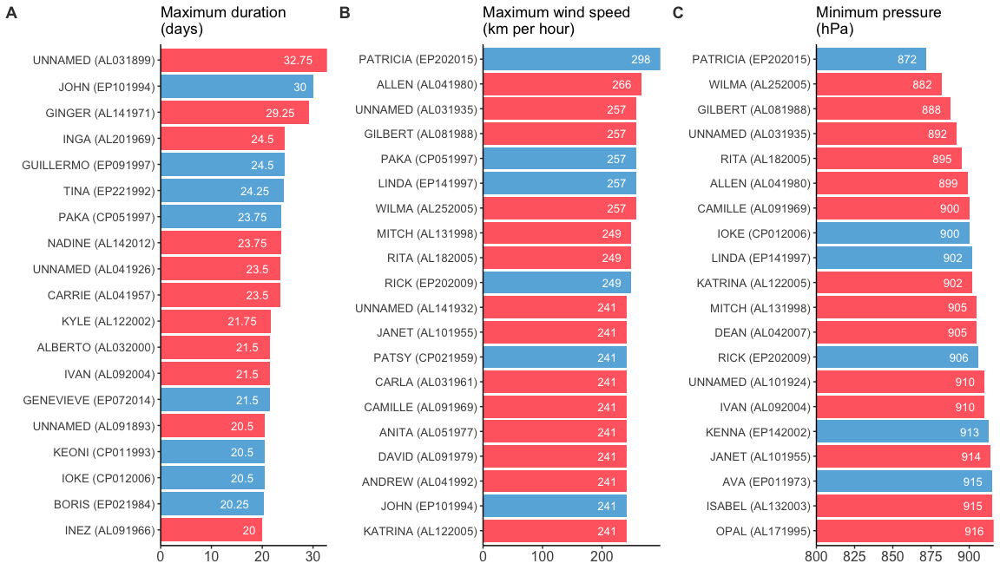

# Storm data exploration (1/2)


## Loading the environment


```r
# Entire workspace.
source_data("https://github.com/thomassie/Storms/blob/master/Preparation/StormDataWorkSpace.RData?raw=true")
```

```
## [1] ".Random.seed" "dd.pacific"   "i"            "dd"          
## [5] "n"            "dd.atlantic"  "dd.i"         "dd.org"
```


## Exploring the data set

First, I generate two data set that include a couple of summary statistics such as minimum pressure or maximum duration for each **storm**...

```r
# Some summary statistics to see which was the strongest storm etc.
dd.sum <- dd %>%
  group_by(Key) %>%
  summarise(Name = unique(Name),
            KeyPlus = unique(KeyPlus),
            Ocean = unique(Ocean),
            Year = first(Year),
            MinPressure = min(Pressure, na.rm = TRUE),
            MaxDuration = max(Duration, na.rm = TRUE),
            MeanWindKPH = round(mean(WindKPH, 0)),
            MaxWindKPH = max(WindKPH, na.rm = TRUE),
            StormStart = format(DateTime[1], "%d/%m %H:%M:%S"),
            StormStop = format(DateTime[length(DateTime)], "%d/%m %H:%M:%S")) %>%
  arrange(-desc(Year)) %>%
  mutate(MinPressureAfter = "NA")

for (i in 1:length(dd.sum$Key)) {
  dd.sum$MinPressureAfter[i] = max(filter(dd, Key == dd.sum$Key[i])$Duration[which(filter(dd, Key == dd.sum$Key[i])$Pressure %in% min(filter(dd, Key == dd.sum$Key[i])$Pressure, na.rm = TRUE))])
}

dd.sum$MinPressureAfter <- as.numeric(dd.sum$MinPressureAfter)

# '-Inf' and 'Inf' values are not useful here.
# If these values are not removed they later appear in the plots.
dd.sum$MinPressure <- as.numeric(gsub("Inf", "NA", dd.sum$MinPressure))
dd.sum$MinPressureAfter <- as.numeric(gsub("-Inf", "NA", dd.sum$MinPressureAfter))

str(dd.sum)
```

```
## Classes 'tbl_df', 'tbl' and 'data.frame':	2900 obs. of  12 variables:
##  $ Key             : Factor w/ 2900 levels "AL011851","AL011852",..: 1 167 332 497 661 818 2 168 333 498 ...
##  $ Name            : chr  "UNNAMED" "UNNAMED" "UNNAMED" "UNNAMED" ...
##  $ KeyPlus         : Factor w/ 2900 levels "ABBY (AL011968)",..: 1598 1725 1847 1965 2078 2186 1599 1726 1848 1966 ...
##  $ Ocean           : Factor w/ 2 levels "Atlantic","Pacific": 1 1 1 1 1 1 1 1 1 1 ...
##  $ Year            : Factor w/ 166 levels "1851","1852",..: 1 1 1 1 1 1 2 2 2 2 ...
##  $ MinPressure     : num  NA NA NA NA NA NA 961 NA NA NA ...
##  $ MaxDuration     : num  3 0 0 11.75 3.75 ...
##  $ MeanWindKPH     : num  98 129 80 105 80 85 118 93 108 117 ...
##  $ MaxWindKPH      : num  129 129 80 161 80 97 161 113 113 129 ...
##  $ StormStart      : chr  "25/06 00:00:00" "05/07 12:00:00" "10/07 12:00:00" "16/08 00:00:00" ...
##  $ StormStop       : chr  "28/06 00:00:00" "05/07 12:00:00" "10/07 12:00:00" "27/08 18:00:00" ...
##  $ MinPressureAfter: num  NA NA NA NA NA NA 7.25 NA NA NA ...
```

...and for each **year**. I will use the latter data set mainly for mapping (see blow).

```r
dd.sum.year <- dd %>%
  group_by(Year) %>%
  summarise(DateTime = first(DateTime),
            # Date = first(DateTime.new[which(Minimum.Pressure == min(Minimum.Pressure, na.rm = TRUE))]),
            MinPressure = min(Pressure, na.rm = TRUE),
            MaxDuration = max(Duration, na.rm = TRUE),
            MeanWindKPH = round(mean(WindKPH, 0)),
            MaxWindKPH = max(WindKPH, na.rm = TRUE),
            NumStorms = length(unique(Key)),
            Items = length(Pressure)) %>%
  arrange(-desc(Year))

# '-Inf' and 'Inf' values are not useful here.
# If these values are not removed they later appear in the plots.
dd.sum.year$MinPressure <- as.numeric(gsub("Inf", "NA", dd.sum.year$MinPressure))
```


But first, I have to assign the exact dates and times for these annual extreme values.

```r
# Get exact date and time for all extreme values!
p.min <- rep(NA, length(unique(dd$Year)))
d.max <- p.min
w.max <- p.min
for (i in 1:length(unique(dd$Year))) {
  p.min[i] = first(filter(dd, 
                          Year == unique(dd$Year)[i] & 
                            Pressure == as.character(dd.sum.year$MinPressure[i]))$DateTime)
  d.max[i] = first(filter(dd, 
                          Year == unique(dd$Year)[i] & 
                            Duration == as.character(dd.sum.year$MaxDuration[i]))$DateTime)
  w.max[i] = first(filter(dd, 
                          Year == unique(dd$Year)[i] & 
                            WindKPH == as.character(dd.sum.year$MaxWindKPH[i]))$DateTime)
}

dd.sum.year <- dd.sum.year %>%
  mutate(DateTime.p = as.POSIXct(p.min, origin = "1970-01-01")) %>%
  mutate(DateTime.d = as.POSIXct(d.max, origin = "1970-01-01")) %>%
  mutate(DateTime.w = as.POSIXct(w.max, origin = "1970-01-01"))
str(dd.sum.year)
```

```
## Classes 'tbl_df', 'tbl' and 'data.frame':	166 obs. of  11 variables:
##  $ Year       : Factor w/ 166 levels "1851","1852",..: 1 2 3 4 5 6 7 8 9 10 ...
##  $ DateTime   : POSIXct, format: "1851-06-25 00:00:00" "1852-08-19 00:00:00" ...
##  $ MinPressure: num  NA 961 924 938 997 934 961 979 938 NA ...
##  $ MaxDuration: num  11.75 11 11.75 5.75 3.75 ...
##  $ MeanWindKPH: num  96 117 135 114 115 111 107 116 119 113 ...
##  $ MaxWindKPH : num  161 161 209 177 177 209 145 145 177 177 ...
##  $ NumStorms  : int  6 5 8 5 5 6 4 6 8 7 ...
##  $ Items      : int  98 134 100 60 35 95 104 86 97 122 ...
##  $ DateTime.p : POSIXct, format: NA "1852-08-26 06:34:08" ...
##  $ DateTime.d : POSIXct, format: "1851-08-27 18:34:08" "1852-08-30 00:34:08" ...
##  $ DateTime.w : POSIXct, format: "1851-08-23 00:34:08" "1852-08-24 00:34:08" ...
```


Then I introduce a couple of choices to get a nice ranking and to narrow the data down to a specific time period.

```r
# The first 'n.select' storms are selected for ranking
n.select <- 20
# Time window: from 'year.min' to 'year.max'. 
# Fill in identical years to get data only of year x.
year.min <- 2012
year.max <- 2015
```


But at first, we will have a glimpse at the rankings comming from the **entire** data.

```r
# Ranking according to...
# ...longest duration (enire data set).
topn.Duration       <- arrange(dd.sum, desc(dd.sum$MaxDuration))[1:n.select,] %>%
  mutate(criterion = "duration")
# Rearrange levels.
topn.Duration$KeyPlus <- factor(topn.Duration$KeyPlus, 
                                levels = topn.Duration$KeyPlus[desc(topn.Duration$MaxDuration)])
# ...strongest wind speed recorded (entire data set)
topn.WindKPH.Max  <- arrange(dd.sum, desc(dd.sum$MaxWindKPH))[1:n.select,] %>%
  mutate(criterion = "wind")
# Rearrange levels.
topn.WindKPH.Max$KeyPlus <- factor(topn.WindKPH.Max$KeyPlus, 
                                   levels = topn.WindKPH.Max$KeyPlus[desc(topn.WindKPH.Max$MaxWindKPH)])
# ...minimum pressure (entire data set)
topn.Pressure.Min  <- arrange(dd.sum, -desc(dd.sum$MinPressure))[1:n.select,] %>%
  mutate(criterion = "pressure")
# Rearrange levels.
topn.Pressure.Min$KeyPlus <- factor(topn.Pressure.Min$KeyPlus, 
                                    levels = topn.Pressure.Min$KeyPlus[desc(topn.Pressure.Min$MinPressure)])
#dd.topn <- rbind(topn.Duration, topn.Strength.Max, topn.Pressure.Min)
```


I generate three barplots, one for each criterion...

```r
# Barplot for duration.
plot.dur <- topn.Duration %>%
  ggplot(aes(x = KeyPlus,
             y = MaxDuration,
             fill = Ocean)) +
  # geom_bar(stat="identity") +
  geom_col(alpha = 0.7) +
  # scale_x_discrete(limits = rev(levels(topn.Duration$ID.plus))) +
  # theme_bw() +
  theme_classic() +
  xlab("") +
  ylab("") +
  ggtitle("Maximum duration \n(days)") +
  theme(axis.text = element_text(size = 10),
        # axis.line = element_blank(),
        # axis.text.x = element_blank(),
        # axis.ticks.y = element_blank(),
        axis.text.x = element_text(angle = 0, hjust = 0.5, size = 12)) +
  geom_text(aes(label = MaxDuration),
            angle = 0,
            size = 3.5,
            color = "white",
            position = position_dodge(width = 0.1),
            hjust = 1.5,
            vjust = 0.5) +
  # theme(panel.border = element_rect(colour = "black", fill = NA, size = 1)) +
  # scale_y_continuous(expand = c(0.1,0)) +
  # geom_hline(yintercept = 0) +
  scale_y_continuous(expand = c(0,0)) +
  scale_fill_manual(values = c("#FF281E", "#0090CF")) +
  coord_flip() +
  scale_x_discrete(limits = rev(levels(topn.Duration$KeyPlus))) +
  rremove("legend")

# Barplot for wind speed.
plot.wind <- topn.WindKPH.Max %>%
  ggplot(aes(x = KeyPlus,
             y = MaxWindKPH,
             fill = Ocean)) +
  geom_col(alpha = 0.7) +
  theme_classic() +
  xlab("") +
  ylab("") +
  ggtitle("Maximum wind speed \n(km per hour)") +
  theme(axis.text = element_text(size = 10),
        axis.text.x = element_text(angle = 0, hjust = 0.5, size = 12)) +
  geom_text(aes(label = MaxWindKPH),
            angle = 0,
            size = 3.5,
            color = "white",
            position = position_dodge(width = 0.1),
            hjust = 1.5,
            vjust = 0.5) +
  scale_y_continuous(expand = c(0,0)) +
  scale_fill_manual(values = c("#FF281E", "#0090CF")) +
  coord_flip() +
  scale_x_discrete(limits = rev(levels(topn.WindKPH.Max$KeyPlus))) +
  rremove("legend")

# Barplot for pressure.
plot.pres <- topn.Pressure.Min %>%
  ggplot(aes(x = KeyPlus,
             y = MinPressure,
             fill = Ocean)) +
  geom_col(alpha = 0.7) +
  theme_classic() +
  xlab("") +
  ylab("") +
  ggtitle("Minimum pressure \n(hPa)") +
  theme(axis.text = element_text(size = 10),
        axis.text.x = element_text(angle = 0, hjust = 0.5, size = 12)) +
  geom_text(aes(label = MinPressure),
            angle = 0,
            size = 3.5,
            color = "white",
            position = position_dodge(width = 0.1),
            hjust = 1.5,
            vjust = 0.5) +
  scale_y_continuous(expand = c(0,0),
                     limits = c(800, max(topn.Pressure.Min$MinPressure)),
                     oob = rescale_none) +
  scale_fill_manual(values = c("#FF281E", "#0090CF")) +
  # coord_cartesian(ylim = c(800, max(topn.Pressure.Min$MinPressure))) +
  scale_x_discrete(limits = rev(levels(topn.Pressure.Min$KeyPlus))) +
  rremove("legend") +
  coord_flip() 
```


...which are ten put together in a single figure. We can now have a look at the 20 storms that lasted the longest (**A**), showed the highest maximum wind speed (**B**), and the lowest minimum pressure (**C**). (I know that one can argue about cuttig the scale here. However, no storm will ever reach 0 hPa, and therefore, I introduced this 'baseline'.)  

```r
plot_grid(plot.dur, plot.wind, plot.pres + remove("x.text"), 
          labels = c("A", "B", "C"),
          label_colour = "#3C3C3C",
          ncol = 3, nrow = 1)
```

<!-- -->

Rankings are a nice way to get an idea about the top of the pops. However, a lot of data is neglected and, hence, one misses a lot of information, too. Here is another way of visualising the storm data: each point represents a measure of minimum pressure (in hPa or mbar).

```r
# Main plot.
plot.pressure.main <- ggplot(data = dd,
                             aes(x = DateTime,
                                 y = Pressure)) +
  geom_point(aes(colour = Ocean),
             alpha = 0.1,
             size = 0.3) +
  geom_point(data = dd.sum.year,
             # geom_point(data = filter(dd.sum.year, year.min <= year(dd.sum.year$DateTime.p) & year(dd.sum.year$DateTime.p) <= year.max),
             aes(x = DateTime.p,
                 y = MinPressure),
             shape = 1,
             size = 1.2,
             stroke = 0.5,
             colour = "#333333") +
  geom_line(data = dd.sum.year,
            aes(x = (DateTime.p),
                y = MinPressure),
            size = 0.3,
            alpha = 0.5,
            colour = "#333333") +
  geom_smooth(data = dd.sum.year,
              # geom_smooth(data = filter(dd.sum.year, year.min <= year(dd.sum.year$DateTime.p) & year(dd.sum.year$DateTime.p) <= year.max),
              aes(x = DateTime.p,
                  y = MinPressure),
              method = "lm",
              se = FALSE,
              span = 0.2,
              # linetype = "dashed",
              colour = "#999999",
              alpha = 0.9,
              size = 0.8) +
  theme_bw() +
  geom_rug(alpha = 0.02,
           colour = "#999999") +
  labs(x = "Year", 
       y = "Minimum in central pressure (mbar)",
       title = "Do extreme events become more severe?",
       subtitle = expression("Storm intensity indicated by minimum in central pressure. \nThe lower the pressure the more intense the storm."),
       caption = "Source: NOAA's National Hurricane Center (http://www.nhc.noaa.gov/data/)") +
  theme(axis.text = element_text(family = "Varela Round"),
        axis.text.x = element_text(size = 11, colour = "#3C3C3C", face = "bold", vjust = 1),
        axis.text.y = element_text(size = 11, colour = "#3C3C3C", face = "bold", vjust = 0),
        axis.ticks = element_line(colour = "#D7D8D8", size = 0.2),
        axis.ticks.length = unit(5, "mm"),
        axis.line = element_blank(),
        plot.title = element_text(face = "bold", hjust = 0, vjust = -0.5, colour = "#3C3C3C", size = 20),
        plot.subtitle = element_text(hjust = 0, vjust = -5, colour = "#3C3C3C", size = 11),
        plot.caption = element_text(size = 8, hjust = 1.5, vjust = -0.05, colour = "#7F8182"),
        # panel.background = element_rect(fill = "#F1EDE2"),
        panel.background = element_rect(fill = "#FAFAF2"),
        panel.border = element_blank(),
        plot.background = element_rect(fill = "#FAFAF2", colour = "#FAFAF2"),
        panel.grid.major = element_line(colour = "#D7D8D8", size = 0.2),
        panel.grid.minor = element_line(colour = "#D7D8D8", size = 0.2)) +
  theme(legend.title = element_blank(),
        legend.justification=c(0,1), 
        legend.position=c(1.02, 0.3),
        legend.background = element_blank(),
        legend.key = element_blank()) +
  # geom_text(data = dd.lines, aes(label = year(int), x = int, y = -Inf), angle = 0, inherit.aes = F, hjust = -0.2, vjust = -36, size = 3.5) +
  # ggpubr::color_palette("jco") +
  # scale_colour_manual(values = c("#B78A3F", "#58758C")) +
  scale_colour_manual(values = c("#FF281E", "#0090CF")) +
  guides(colour = guide_legend(override.aes = list(alpha = 1))) 

# A density plot on top of the main plot.
# TREAT the date.time AS NUMERIC!!!
plot.pressure.dens.x <- axis_canvas(plot.pressure.main, axis = "x") + 
  geom_density(data = dd, aes(x = as.numeric(DateTime), fill = Ocean),
               alpha = 0.6, size = 0.2) +
  # ggpubr::color_palette("jco")
  # scale_fill_manual(values = c("#B78A3F", "#58758C"))
  scale_fill_manual(values = c("#FF281E", "#0090CF"))
# ...and one on the right site.
plot.pressure.dens.y <- axis_canvas(plot.pressure.main, axis = "y", coord_flip = TRUE) +
  geom_density(data = dd, aes(x = as.numeric(Pressure), fill = Ocean),
               alpha = 0.6, size = 0.2) +
  # ggpubr::color_palette("jco") +
  # scale_fill_manual(values = c("#B78A3F", "#58758C")) +
  scale_fill_manual(values = c("#FF281E", "#0090CF")) +
  coord_flip()
```

Now, one can combine all three plots to a single figure.

```r
plot.pressure.1 <- insert_xaxis_grob(plot.pressure.main, 
                                     plot.pressure.dens.x, 
                                     grid::unit(0.2, "null"), 
                                     position = "top")
plot.pressure.2 <- insert_yaxis_grob(plot.pressure.1, 
                                     plot.pressure.dens.y, 
                                     grid::unit(.2, "null"), 
                                     position = "right")
ggdraw(plot.pressure.2)
```

<!-- -->

Now, the same figure for wind speed.

```r
# Main plot.
plot.wind.main <- ggplot(data = dd,
                         aes(x = DateTime,
                             y = WindKPH)) +
  geom_point(aes(colour = Ocean),
             alpha = 0.1,
             size = 0.3) +
  geom_point(data = dd.sum.year,
             # geom_point(data = filter(dd.sum.year, year.min <= year(dd.sum.year$DateTime.p) & year(dd.sum.year$DateTime.p) <= year.max),
             aes(x = DateTime.p,
                 y = MaxWindKPH),
             shape = 1,
             size = 1.2,
             stroke = 0.5,
             colour = "#333333") +
  geom_line(data = dd.sum.year,
            aes(x = (DateTime.p),
                y = MaxWindKPH),
            size = 0.3,
            alpha = 0.5,
            colour = "#333333") +
  geom_smooth(data = dd.sum.year,
              # geom_smooth(data = filter(dd.sum.year, year.min <= year(dd.sum.year$DateTime.p) & year(dd.sum.year$DateTime.p) <= year.max),
              aes(x = DateTime.p,
                  y = MaxWindKPH),
              method = "lm",
              se = FALSE,
              span = 0.2,
              # linetype = "dashed",
              colour = "#999999",
              alpha = 0.9,
              size = 0.8) +
  theme_bw() +
  geom_rug(alpha = 0.02,
           colour = "#999999") +
  labs(x = "Year", 
       y = "Maximum wind speed (km/h)",
       title = "Do extreme events become more severe?",
       subtitle = expression("Storm intensity indicated by maximum wind speed."),
       caption = "Source: NOAA's National Hurricane Center (http://www.nhc.noaa.gov/data/)") +
  theme(axis.text = element_text(family = "Varela Round"),
        axis.text.x = element_text(size = 11, colour = "#3C3C3C", face = "bold", vjust = 1),
        axis.text.y = element_text(size = 11, colour = "#3C3C3C", face = "bold", vjust = 0.5),
        axis.ticks = element_line(colour = "#D7D8D8", size = 0.2),
        axis.ticks.length = unit(5, "mm"),
        axis.line = element_blank(),
        plot.title = element_text(face = "bold", hjust = 0, vjust = -0.5, colour = "#3C3C3C", size = 20),
        plot.subtitle = element_text(hjust = 0, vjust = -1, colour = "#3C3C3C", size = 11),
        plot.caption = element_text(size = 8, hjust = 1.5, vjust = -0.05, colour = "#7F8182"),
        panel.background = element_rect(fill = "#FAFAF2"),
        panel.border = element_blank(),
        plot.background = element_rect(fill = "#FAFAF2", colour = "#FAFAF2"),
        panel.grid.major = element_line(colour = "#D7D8D8", size = 0.2),
        panel.grid.minor = element_line(colour = "#D7D8D8", size = 0.2)) +
  theme(legend.title = element_blank(),
        legend.justification=c(0,1), 
        legend.position=c(1.0, 0.95),
        legend.background = element_blank(),
        legend.key = element_blank()) +
  # geom_text(data = dd.lines, aes(label = year(int), x = int, y = -Inf), angle = 0, inherit.aes = F, hjust = -0.2, vjust = -36, size = 3.5) +
  # ggpubr::color_palette("jco") +
  # scale_colour_manual(values = c("#B78A3F", "#58758C")) +
  scale_colour_manual(values = c("#FF281E", "#0090CF")) +
  guides(colour = guide_legend(override.aes = list(alpha = 1)))
# title = paste("Minimum pressure recorded for years", year.min, "to", year.max))
# ggtitle(paste("Minimum pressure recorded for years", year.min, "to", year.max))

# A density plot on top of the main plot.
# TREAT the date.time AS NUMERIC!!!
plot.wind.dens.x <- axis_canvas(plot.wind.main, axis = "x") + 
  geom_density(data = dd, aes(x = as.numeric(DateTime), fill = Ocean),
               alpha = 0.6, size = 0.2) +
  # ggpubr::color_palette("jco")
  # scale_fill_manual(values = c("#B78A3F", "#58758C"))
  scale_fill_manual(values = c("#FF281E", "#0090CF"))
# ...and one on the right site.
plot.wind.dens.y <- axis_canvas(plot.wind.main, axis = "y", coord_flip = TRUE) +
  geom_density(data = dd, aes(x = as.numeric(WindKPH), fill = Ocean),
               alpha = 0.6, size = 0.2) +
  # ggpubr::color_palette("jco") +
  # scale_fill_manual(values = c("#B78A3F", "#58758C")) +
  scale_fill_manual(values = c("#FF281E", "#0090CF")) +
  coord_flip()
```

Again, combining all subplots...

```r
plot.wind.1 <- insert_xaxis_grob(plot.wind.main, 
                                 plot.wind.dens.x, 
                                 grid::unit(0.2, "null"), 
                                 position = "top")
plot.wind.2 <- insert_yaxis_grob(plot.wind.1, 
                                 plot.wind.dens.y, 
                                 grid::unit(.2, "null"), 
                                 position = "right")
ggdraw(plot.wind.2)
```

<!-- -->


## Storing the data set

Again, I save the workspace for further analysis!

```r
save.image("StormDataWorkSpace.RData")
```


